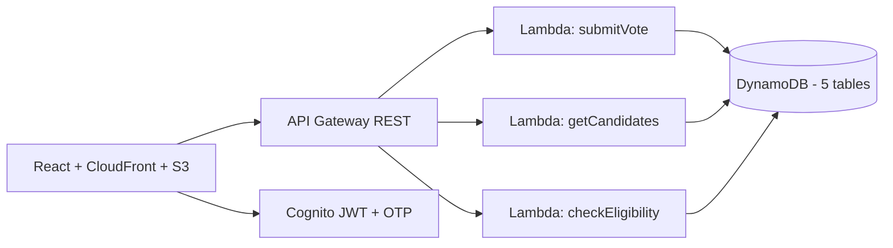

<div align="center">

# Online Voting System

Serverless voting platform on AWS for live college elections — OTP auth, animated results, admin controls.

[](https://github.com/prathameshlonare/Online-voting-system/blob/main/LICENSE.txt)
[](https://github.com/prathameshlonare/Online-voting-system/actions)
[](https://github.com/prathameshlonare/Online-voting-system/stargazers)

</div>

## Table of Contents

- [What is this?](#what-is-this)
- [Why?](#why)
- [Quick Start](#quick-start)
- [Architecture](#architecture)
- [Tech Stack](#tech-stack)
- [Project Structure](#project-structure)
- [Documentation](#documentation)
- [Features](#features)
- [CI/CD Pipeline](#cicd-pipeline)
- [Screenshots](#screenshots)
- [Contributing](#contributing)
- [Connect](#connect)
- [Team](#team)
- [License](#license)

## What is this?

A React + Python Lambda voting app backed by DynamoDB, Cognito, and API Gateway, with Terraform + CloudFormation for reproducible deploys. It ran a real departmental election for 500+ students. Frontend runs in mock mode with no backend for demo.

> **Live Demo:** https://prathameshlonare.me/voting/ — no setup needed, runs with mock data.
>
> **Demo logins (1-click fill on login page):**
> | Role | Email | Password |
> |------|-------|----------|
> | Voter (Student) | `student@rcert.edu` | `password123` |
> | Admin | `admin@rcert.edu` | `admin123` |

## Why?

Our department voted the old way: mark your pick's initials for President and Secretary on a chit, drop it in a box, count everything by hand. We replaced that with this system and ran a real departmental election on it — 500+ students, eligibility checked against the attendance CSV the admin uploads. The first version is just frontend + backend wired up manually in the AWS console.

## Quick Start

```bash
# Clone
git clone https://github.com/prathameshlonare/Online-voting-system.git
cd Online-voting-system

# Demo frontend only (no backend / AWS needed)
cd frontend
yarn install
yarn start
# open http://localhost:3000
```

```bash
# Full local stack (recommended)
cd docker
docker compose up -d
# app: http://localhost:3000
```

```bash
# Frontend with real backend
cd frontend
REACT_APP_API_URL=http://localhost:4000 yarn start
```

```bash
# Deploy to AWS (test-only: plan first, apply → verify → destroy same session)
cd infra/terraform
terraform init && terraform plan

cd ../cloudformation
sam build && sam deploy --guided
```

## Architecture




## Tech Stack

| Layer | Technology |
|-------|------------|
| Frontend | React 18, Material UI, React Router v6 |
| Backend | Python 3.9 Lambda, API Gateway REST |
| Auth | Amazon Cognito (JWT, OTP verification) |
| Database | DynamoDB (5 tables, PAY_PER_REQUEST) |
| Storage | S3 (React app + attendance CSV) |
| IaC | Terraform (VPC/IAM) + CloudFormation (app stacks) |
| CI/CD | GitHub Actions (lint, test, Bandit, deploy) |
| Container | Docker multi-stage (Node → nginx, 25MB) |
| Monitoring | CloudWatch Dashboard + Alarms |

## Project Structure

```
Online-voting-system/
├── backend/
├── docker/
├── frontend/
├── infra/
├── screenshots/
├── .github/
├── LICENSE.txt
├── README.md
├── DEVOPS-PLAN.md
├── DevOps_Learning_and_Project_Transformation_Plan.md
```

See folder READMEs for details. Backend has 12 Lambda handlers (`submitVote.py`, `checkEligibility.py`, `getCandidate.py`, etc.). Frontend has 15 components + mock API layer.

## Documentation

| Resource | Description |
|----------|-------------|
| [frontend/README.md](frontend/README.md) | React app, mock/HTTP modes, components |
| [backend/README.md](backend/README.md) | Lambda handlers and API |
| [infra/README.md](infra/README.md) | Terraform + CloudFormation stacks |
| [docker/README.md](docker/README.md) | Compose, multi-stage build, nginx |
| [.github/workflows/ci.yml](.github/workflows/ci.yml) | Lint, test (34 Jest), Bandit, build |
| [LICENSE.txt](LICENSE.txt) | MIT license |

## Features

### Voters
- Email/password registration with OTP confirmation
- Multi-step flow (Login → OTP → Select → Confirm → Submit)
- Real-time election status indicator
- Animated results with confetti

### Administrators
- Start/stop elections, declare results, reset cycle
- Manage candidates (add/remove)
- Upload student attendance CSV

### DevOps
- IaC (Terraform + CloudFormation SAM)
- CI/CD with GitHub Actions
- Docker multi-stage builds, isolated networks, persisted DynamoDB volume
- CloudWatch dashboard + alarms

## CI/CD Pipeline

```yaml
# .github/workflows/ci.yml
1. Lint (ESLint)
2. Test (Jest + coverage)
3. Security (Bandit + npm audit)
4. Build (React bundle)
```

Live demo is statically hosted on portfolio (no auto-deploy from this repo).

> DevOps numbers (image size, pipeline duration, load/latency) are being rebuilt from scratch per `DEVOPS-PLAN.md` and will be recorded in `docs/METRICS.md` — nothing claimed until measured.

## Screenshots

| Screen | Preview |
|--------|---------|
| **Login** - voter / admin entry with 1-click demo fill |  |
| **Sign Up** - registration with student ID + OTP step |  |
| **Welcome** - landing page with election info |  |
| **Vote Form** - ballot for President + Secretary |  |
| **Election Control** - admin start / stop / declare |  |
| **Add Candidate** - admin candidate management |  |
| **Vote Result** - confirmation after submit |  |
| **Results** - animated counts with celebration |  |

## Contributing

PRs welcome. Run lint + tests before pushing:

```bash
cd frontend
yarn install
npx eslint src/ --ext .js,.jsx
yarn test -- --watchAll=false
```

<a href="https://github.com/prathameshlonare/Online-voting-system/graphs/contributors">
  
</a>

## Connect

[](https://www.linkedin.com/in/prathamesh-lonare21/)

## Team

**Prathamesh Lonare**
- [LinkedIn](https://www.linkedin.com/in/prathamesh-lonare21/)
- [GitHub](https://github.com/prathameshlonare)
- [Portfolio](https://prathameshlonare.me)

**Contributors:** Swapnil Kumbhare, Mohak Talodhikar, Suyog Madavi — departmental election project team.

## License

MIT License — see [LICENSE.txt](LICENSE.txt)

---

<div align="center">

**Try the [live demo](https://prathameshlonare.me/voting/) — Star the repo if it's useful — PRs welcome!**

[](https://star-history.com/#prathameshlonare/Online-voting-system&Date)

</div>
